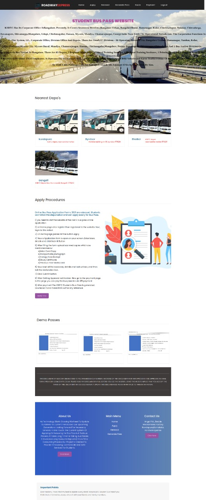

# Online-buspass-portal
  <code></code>


<code></code>
  <code></code>
```diff
- text in red
! text in orange
# text in gray
@@ text in purple (and bold)@@
```
<h2>Online Student Bus Pass Portal is a web application for students to get bus passes through online. 
Before this application implementation the manual process is used to do the process of issuing the Bus pass to the students. This Manual process requires man power and more time consuming. To avoid such difficulties, we implemented this system.
The key components of Online Student Bus Pass Portal are <br>
 1)Bus pass generation  <br>
 2)Bus pass renewal</h2>
 <hr>
 
 <b>Home Page</b>
 
 
 
 <hr>
 Language to be used:
Front end: HTML, CSS, Bootstrap, JavaScript
Backend: python

1.6 Hardware and Software Requirements:
	1.6.1 Hardware Requirements: 
Processor: Intel Pentium 4 or above
RAM: 4GB
Hard Disk :40GB
	1.6.2 Software Interface:
Database: MySQL
Framework: Django
Tools used (OS): windows XP and above
