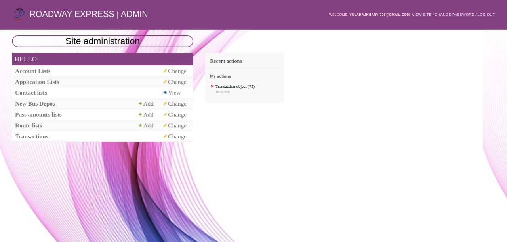

# Online-buspass-portal <a href="https://roadwayexpressportal.pythonanywhere.com/">CLICK HERE</a>
  
<b>Online Student Bus Pass Portal is a web application for students to get bus passes through online. 
Before this application implementation the manual process is used to do the process of issuing the Bus pass to the students. This Manual process requires man power and more time consuming. To avoid such difficulties, we implemented this system.
The key components of Online Student Bus Pass Portal are <br>
 1)Bus pass Generation  <br>
 2)Bus pass Renewal</b>
 <hr>
 
 <b><h3>Home Page</h3></b>
 
 
 
 <hr>
 <b>Language to be used:</b><br>
	&emsp;Front end: HTML, CSS, Bootstrap, JavaScript<br>
	&emsp;Backend: python<br>

 <b>Hardware and Software Requirements:</b><br>
	&emsp;Hardware Requirements: <br>
        	&emsp;&emsp;Processor: Intel Pentium 4 or above <br>
         	&emsp;&emsp;RAM: 4GB <br>
                &emsp;&emsp;Hard Disk :40GB <br>
	&emsp;Software Interface: <br>
                &emsp;&emsp;Database: MySQL <br>
                &emsp;&emsp;Framework: Django <br>
                &emsp;&emsp;Tools used (OS): windows XP and above
		
		
<hr>
<b>Django is based on MVT (Model-View-Template) architecture.<br> MVT is a software design pattern for developing a web application.</b>

<i><b>Model:</i></b><br> The model is going to act as the interface of your data. It is responsible for maintaining data. It is the logical data structure behind the entire application and is represented by a database

`Commands for Any changes in model is :`<br>
```diff
python manage.py make migrations
```
```diff
Python manage.py migrate
```
<i><b>View:</i></b><br> The View is the user interface - what you see in your browser when you render a website. It is represented by HTML/CSS/Javascript and Jinja files.

<i><b>Template:</i></b><br> A template consists of static parts of the desired HTML output as well as some special syntax describing how dynamic content will be inserted


```diff
python manage.py make migrations
```
<br>
When you make changes to your models, your database needs to understand how these changes might affect the database. This command automatically makes files that document these changes.<br>

```diff
Python manage.py migrate
```
This command replaces `python manage.py syncdb` in many ways and the main one being that `migrate` means it will update your database to the latest version of your Django models.

```diff
python manage.py createsuperuser
```

This command is used for creating super user (Admin)

<b><h3>Admin Page</h3></b>


```diff
Python manage.py runserver
```
<b>Deployed active links
Online student bus-pass portal:
https://roadwayexpressportal.pythonanywhere.com/

Personal projects-

Event Creator: https://roadwayexpress.pythonanywhere.com/calendar/

User profile:https://roadwayexpress.pythonanywhere.com/User/Login/


It used to run a emulated server on your local computer. So, after running it, you can go to [localhost:8000](http://localhost:8000) or [127.0.0.1:8000](http://127.0.0.1:8000)

<b><h4>Generate pass Page:</h4></b>
Allows student to generate their pass after approval and payment for pass
<h3><b>More reference <a href="https://docs.djangoproject.com/en/3.2/" target="_blank" >click here.</a></b></h3>

<code></code>
<code></code>
<code></code>
